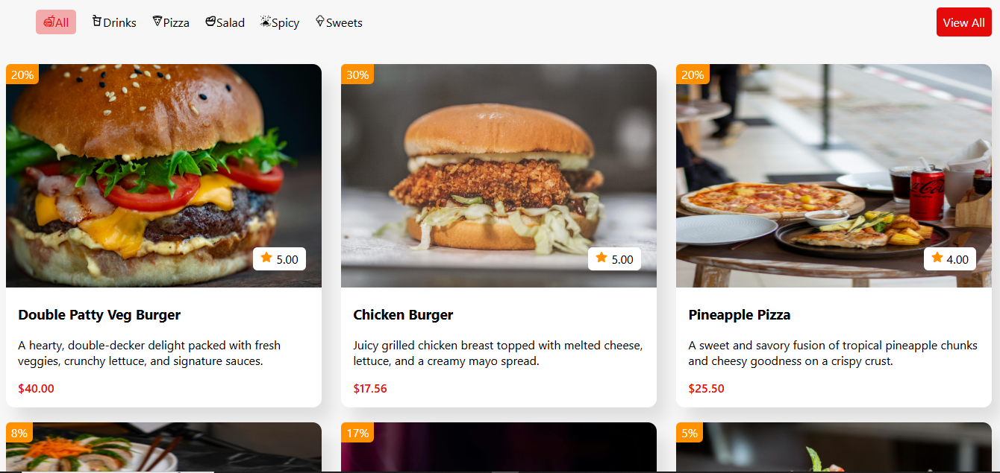

# 🍔 Product Listing UI (React + CSS)

A minimal, responsive product listing section built using **React** and **Flexbox**, showcasing a series of items like burgers, pizza, and salad with discount tags and ratings.

## 🚀 Features

- ✅ Responsive layout: 3 items per row (auto-adjusts on smaller screens)
- ✅ Modular `Listing` and `ListingItem` components
- ✅ Data-driven via `listingItems` array
- ✅ Custom icons (react-icons) for ratings
- ✅ Global styles via `index.css`

## 📸 Preview



## 🛠️ Tech Stack

- React
- JavaScript (ES6+)
- CSS (Flexbox)
- [react-icons](https://react-icons.github.io/react-icons)

## 📦 Installation

```bash
npm install
npm run dev
